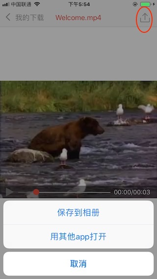

## 欢迎使用闪电下载

你可以通过闪电下载将网络上的视频，音乐，压缩包，Doc等任意文件下载到你的手机上。

A站, B站, 爱奇艺, 网易云音乐 - 随便什么都行.

### 如何下载

1. 输入并打开一个网址（很多app里点分享，会有一个复制链接的按钮）

2. 点击你要下载的链接或文件

3. 闪电下载检测到你点的链接可以下载时就会请求下载了

### 下面是几个演示用的下载链接，点击后就可以下载，去试试吧👇:

* [下载Zip文件](./欢迎使用.zip)
* [这是一张图片]()
* [这是PDF文件f]()
* 下面是一段视频，点击他就可以下载

### 保存到手机相册

